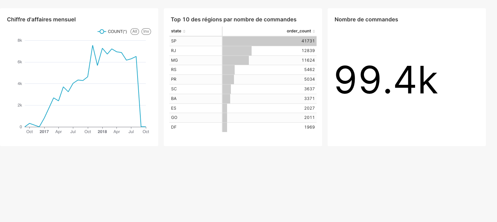

# Système d'analyse des ventes d'e-commerce

## 📋 Contexte
Data Engineer pour une entreprise d'e-commerce, vous devez mettre en place un système d'analyse complet des ventes via un pipeline de données.

## 📊 Données sources
"Brazilian E-Commerce Public Dataset by Olist" (Kaggle)
* Plusieurs fichiers CSV contenant des données sur :
  * Commandes
  * Produits
  * Clients
  * Vendeurs

## 🎯 Objectifs du projet
* Créer un pipeline ETL complet
* Mettre en place un data warehouse
* Préparer les données pour l'analyse

## 🛠 Étapes du projet

### 1. Ingestion des données
* Création de scripts Python pour la lecture des fichiers CSV
* Mise en place d'une validation basique des données
* Simulation d'un système d'ingestion incrémentale

### 2. Stockage
* Création d'une base de données PostgreSQL locale
* Définition du schéma du data warehouse (modèle en étoile)
* Implémentation des tables dimensions et faits

### 3. Transformation
* Nettoyage des données
  * Gestion des valeurs manquantes
  * Élimination des doublons
* Création des transformations métier
  * Calcul du chiffre d'affaires journalier
* Enrichissement des données
  * Ajout de catégories temporelles

### 4. Pipeline et Orchestration
* Utilisation d'Apache Airflow
  * Création de DAGs
  * Automatisation des processus
* Implémentation des contrôles qualité

### 5. Accès aux données
* Création de vues SQL optimisées
* Mise en place d'agrégations précalculées
* Préparation de requêtes types pour l'analyse

## 📐 Modélisation

### Structure du Data Warehouse
* **Table de faits** : `orders_fact`
* **Tables de dimensions** :
  * `customers_dim`
  * `products_dim`
  * `sellers_dim`
  * `time_dim`

### Métriques principales
* Chiffre d'affaires quotidien/mensuel
* Nombre de commandes par région
* Performance des vendeurs
* Délais de livraison moyens

## 💻 Stack technique
* **Python**
  * pandas
  * SQLAlchemy
* **PostgreSQL**
* **Apache Airflow**
* **Git**

## ⭐ Bonus
* Tests unitaires
* Système de logging
* Tableaux de bord (Metabase ou Preset)
* Conteneurisation Docker

## 📦 Livrables
1. Scripts Python ETL
2. Schéma de base de données
3. DAGs Airflow
4. Documentation technique
5. Tests unitaires
6. Procédures de déploiement

## 🎓 Compétences développées
* Modélisation de données
* Manipulation de données réelles
* Architecture data complète
* Utilisation d'outils standards de l'industrie